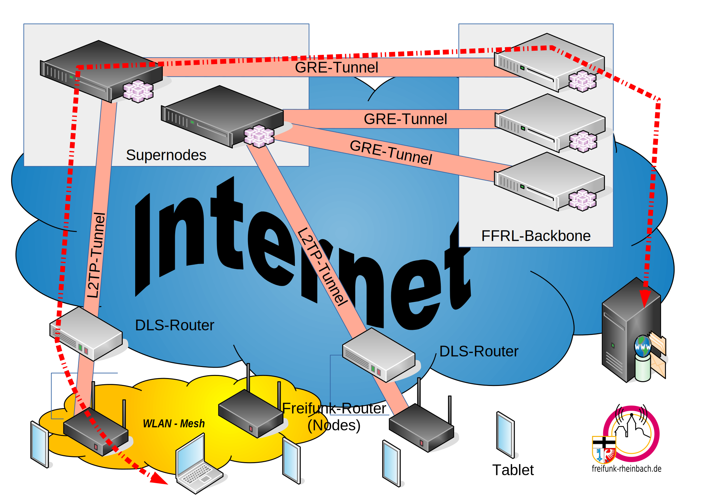

# Installing Freifunk Supernodes

To connect your Freifunk routers / nodes to the Freifunk Rheinland backbone you need at least one node called **supernode**. All nodes of a Freifunk community connect to one or more supernode which concentrate the traffic and pass it to the nodes in the backbone.

## Operating system

In this documentation we use Debian strech / buster. You may used Ubuntu. The differences doesn't matter because we use a minimal system.

## General functional principle

The grafic below show the Freifunk connection principle. 

Most traffic will go from and to a client (computer, tablet or smartphone) trough the node via the supernode and the backbone nodes to the target  host.

This documentation describes how to install and configure the supernode in the top left corner of the picture.

In our case each supernode will establish 6 GRE-tunnels to the FFRL backbone. The nodes will estabish lots of L2TP-tunnels to our supernodes. Generally we will accept connections from every node.

Our supernodes are 'big' routers who direct the traffic from the clients to the backbone and vice versa. 

## Required functions

Our supernodes are mainly router but they have some additional tasks to do.

We connect every node with only one L2TP tunnel to one supernode at a time. We use **tunneldigger** on our nodes and supernodes for this task.

The nodes build local mesh networks. On the mesh interfaces we run  B.A.T.M.A.N adv. BATMAN routes ethernet traffic on layer 2 and not IP packets on layer 3. Our supernodes take part in these mesh network and connect the multiple local meshes to one global mesh. For the clients this looks like a very big switch.

For the connections to the backbone node we use simple GRE tunneling. *We do not run BATMAN on GRE-tunnels.*

<u>Remark: Caveeats</u>

There are some very good reasons why you normaly route on layer 3 and not on layer 2. One reason is to limit broadcast traffic. ARP requests will send via the supernodes to every node and client. The bigger the net, the more traffic you will get. 

To avoid this we seperate the nodes of different regions into domains or hoods.

The supernodes route traffic between these hoods. At the time of writing we use one domain for Meckenheim, one for Rheinbach, two domains to transfer the nodes from the old supernodes to the new supernodes and one test domain.

## Additional functions

To get the whole network up and running we need some additional functions on the supernodes.

### Dynamic Host Configuration Protocol (DHCP)

We use the supernodes to assign IPv4 addresses to the clients.  One supernode ist the primary DHCP server the other works in fallback as a secondary DHCP server.

### Domain Name System (DNS)

To avoid sending every DNS request via the GRE-Tunnel into the backbone we provide DNS sercive on the supoernodes.

### Network Time Protocol (NTP)

In some cases nodes need a time. Most Freifunk router don't have a battery buffered clock. The software does not use the local router to get a time. Our supernodes provide therefore the time via NTP.

...

tbc

